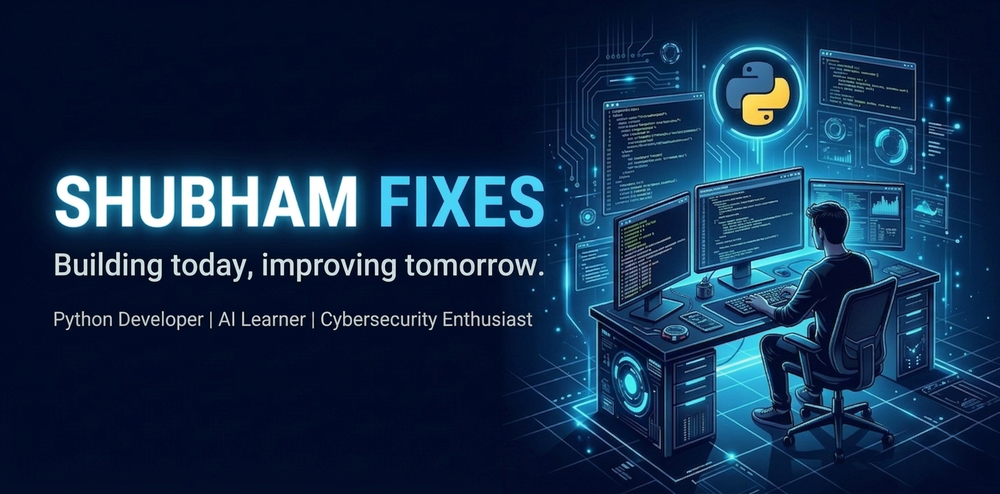

<h1 align="left">💫 Hi 👋, I'm Shubham Fixes</h1>

###

<h4 align="left">🚀 A passionate Python Learner, Project Builder & Tech Enthusiast from Haryana, India 🇮🇳</h4>

###

<h3 align="left">## 👤 About Me</h3>

###

<h4 align="left">- 🌱 Currently learning Python, AI Tools & Automation - 🛠 Building real-world Python projects and improving my problem-solving skills daily - 🤖 Exploring AI-powered tools, automation workflows, and modern technologies - 📚 Following the 100 Days of Code journey and consistently practicing coding - 🔭 Interested in Python Development, AI, Automation & Project Building - 💬 Ask me about Python basics, beginner-friendly projects, GitHub & coding journey - 🎯 Goal: To become a skilled developer by building projects and learning continuously - 📫 Reach me at: 26shubhampandit2006@gmail.com - ⚡ Fun fact: I enjoy building, experimenting, and learning new tech every day 🚀</h4>

###

  

###

<h2 align="left">
### 💻 I Code With</h2>

###

  
  
  
  
  
  
  
  
  
  
  

###

  
  
  
  
  

###

###

  
  

###

###

  

###

  

###